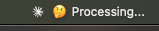

# CCMenuBar - Claude Code Status Tracker for macOS 🚀

A lightweight macOS menu bar app that displays Claude Code's real-time status, perfect for keeping track of what Claude is doing while you work on other things.




## What is this?

CCMenuBar puts Claude Code's activity right in your macOS menu bar. Whether Claude is running tools, needs your attention, or has finished a task, you'll see it at a glance without switching windows. Perfect for long-running tasks or when you want to multitask while Claude works!

> **I'm petty af so this is mostly just a vibe-coded app I made to prove a point. That being said, it's pretty nice, IMHO. Most of it is still in development, especially the "enhanced" version. I would recommend, if you want to try it - clone the repo, read the applescript, read the shell script, set up the hooks, and install it yourself - if you don't have much experience with that, it's a good way to learn. That being said, there are install-helpers to make it easier as well. I think there's even a brew distribution. Since you asked for my opinion, if you see something nice, and it's not open source, just build it yourself/have your AI assistant build it. It's way more fun.** 

## Features

- 🎯 **Real-time status updates** in your macOS menu bar
- 🔧 **Claude Code hooks integration** for automatic updates
- 🎨 **Custom Claude icon** for easy identification
- 📝 **Simple command-line interface** for manual updates
- ⚡ **Lightweight** AppleScript-based implementation

## Quick Start

### Prerequisites

- macOS (tested on macOS 12+ but should work on earlier versions)
- Claude Code CLI installed
- Basic command line familiarity

### Installation

1. **Clone this repository:**
   ```bash
   git clone https://github.com/hesreallyhim/ccmenubar.git
   cd ccmenubar
   ```

2. **Build the menu bar app:**
   - Open `CCMenuBar.scpt` in Script Editor
   - Choose **File → Export...**
   - Set these options:
     - **File Format:** Application
     - **Name:** CCMenuBar
     - ☑️ **Stay open after run handler** (IMPORTANT!)
     - **Where:** /Applications (or your preferred location)
   - Click **Save**

3. **Add the icon to the app:**
   ```bash
   cp claude_logo.png /Applications/CCMenuBar.app/Contents/Resources/
   ```

4. **Install the command-line wrapper:**
   ```bash
   sudo cp ccmenubar /usr/local/bin/
   sudo chmod +x /usr/local/bin/ccmenubar
   ```

5. **Launch the app:**
   ```bash
   ccmenubar --start
   # Or double-click CCMenuBar.app in /Applications
   ```

You should now see " CLAUDE" in your menu bar!

## Usage

### Manual Updates

Update the status from anywhere in your terminal:

```bash
# Simple status updates
ccmenubar "🔨 Building project..."
ccmenubar "✅ Build complete!"
ccmenubar "🐛 Debugging issue"

# Dynamic updates
ccmenubar "$(date '+%H:%M') - Idle"
ccmenubar "CPU: $(top -l 1 | grep 'CPU usage' | awk '{print $3}')"

# From scripts
#!/bin/bash
ccmenubar "🚀 Deployment started"
./deploy.sh
ccmenubar "✅ Deployment complete"
```

### Command Options

```bash
ccmenubar "text"       # Set the status text
ccmenubar --start      # Launch the menu bar app
ccmenubar --quit       # Quit the app
ccmenubar --status     # Check if app is running
ccmenubar --help       # Show help message

# Pipe support
echo "Status update" | ccmenubar -
```

## Claude Code Integration 🤖

The real magic happens when you integrate CCMenuBar with Claude Code hooks!

### Setup Claude Code Hooks

1. **Copy the example settings to your project:**
   ```bash
   cp settings.json ~/your-project/.claude/settings.json
   ```

2. **Customize the hooks** (or use the defaults):

   ```json
   {
     "$schema": "https://json.schemastore.org/claude-code-settings.json",
     "hooks": {
       "PreToolUse": [
         {
           "matcher": "*",
           "hooks": [
             {
               "type": "command",
               "command": "tool=$(echo \"$(cat)\" | jq -r .tool_name); ccmenubar \"🟢 Running: $tool\""
             }
           ]
         }
       ],
       "Notification": [
         {
           "hooks": [
             {
               "type": "command",
               "command": "ccmenubar \"❗ ATTN!\""
             }
           ]
         }
       ],
       "Stop": [
         {
           "hooks": [
             {
               "type": "command",
               "command": "ccmenubar \"✅ DONE\""
             }
           ]
         }
       ]
     }
   }
   ```

### Available Hooks

| Hook | Trigger | Example Status |
|------|---------|----------------|
| `PreToolUse` | Before Claude runs any tool | 🟢 Running: bash |
| `PostToolUse` | After tool completion | ✔️ Completed: write_file |
| `Notification` | When Claude needs attention | ❗ ATTN! |
| `Stop` | When task completes | ✅ DONE |
| `Error` | On errors | ❌ Error occurred |

### Advanced Hook Examples

```json
{
  "hooks": {
    "PreToolUse": [
      {
        "matcher": "bash",
        "hooks": [
          {
            "type": "command",
            "command": "ccmenubar \"🖥️ Executing shell command...\""
          }
        ]
      },
      {
        "matcher": "write_file",
        "hooks": [
          {
            "type": "command",
            "command": "file=$(echo \"$(cat)\" | jq -r .path); ccmenubar \"✏️ Writing: $(basename $file)\""
          }
        ]
      }
    ]
  }
}
```

## Customization Ideas 💡

### Time Tracking
```bash
# Add to PreToolUse hook
ccmenubar "$(date '+%H:%M') - Working..."
```

### Project Context
```bash
# Add project name to status
ccmenubar "📁 $(basename $(pwd)): Building..."
```

### Git Branch Indicator
```bash
# Show current branch
branch=$(git branch --show-current 2>/dev/null || echo "no-git")
ccmenubar "🌿 $branch: Coding..."
```

### System Resource Monitor
```bash
# Create a monitoring script
#!/bin/bash
while true; do
    cpu=$(ps -A -o %cpu | awk '{s+=$1} END {print s "%"}')
    ccmenubar "CPU: $cpu"
    sleep 5
done
```

## Troubleshooting

### App doesn't stay in menu bar
- Make sure you exported with "Stay open after run handler" checked
- The app needs to be a stay-open application to persist

### "command not found: ccmenubar"
```bash
# Check if installed
ls -la /usr/local/bin/ccmenubar

# If missing, reinstall
sudo cp ccmenubar /usr/local/bin/
sudo chmod +x /usr/local/bin/ccmenubar
```

### Icon not showing
```bash
# Verify icon is in the right place
ls -la /Applications/CCMenuBar.app/Contents/Resources/claude_logo.png

# If missing, copy it
cp claude_logo.png /Applications/CCMenuBar.app/Contents/Resources/
```

### Status not updating from Claude Code
1. Check if the app is running: `ccmenubar --status`
2. Test manual update: `ccmenubar "Test"`
3. Verify jq is installed: `brew install jq`
4. Check Claude Code settings: `claude code settings --show`

### App crashes or won't start
- Open Console.app and filter for "CCMenuBar" to see error messages
- Try rebuilding the app from the AppleScript source
- Make sure you're on a supported macOS version

## Pro Tips 🎯

1. **Auto-start on login:** Add CCMenuBar.app to System Preferences → Users & Groups → Login Items

2. **Quick toggle:** Create an alias in your `.zshrc`:
   ```bash
   alias ccs='ccmenubar'  # Now use: ccs "Status"
   ```

3. **Project-specific statuses:** Add to your project's Makefile:
   ```makefile
   build:
       @ccmenubar "🔨 Building $(PROJECT_NAME)..."
       @$(MAKE) compile
       @ccmenubar "✅ Build complete!"
   ```

4. **Combine with other tools:**
   ```bash
   # With tmux
   tmux send-keys "ccmenubar 'Running in tmux'" C-m

   # With watch
   watch -n 5 'ccmenubar "Files: $(ls -1 | wc -l)"'
   ```

## Contributing

Found a bug? Have an idea? Feel free to:
- Open an issue
- Submit a pull request
- Share your custom hooks and use cases!

## License

GPL-3.0

## Acknowledgments

- Built for the [Claude Code](https://claude.ai) community
- Icon designed for optimal menu bar visibility
- Inspired by the need to track long-running AI tasks
- Claude Code, and the Claude Logo, are the property of Anthropic.

---

**Happy coding with Claude!** 🤖✨

*Remember: The menu bar is your window into Claude's mind. Keep an eye on it, and you'll always know what your AI assistant is up to!*
